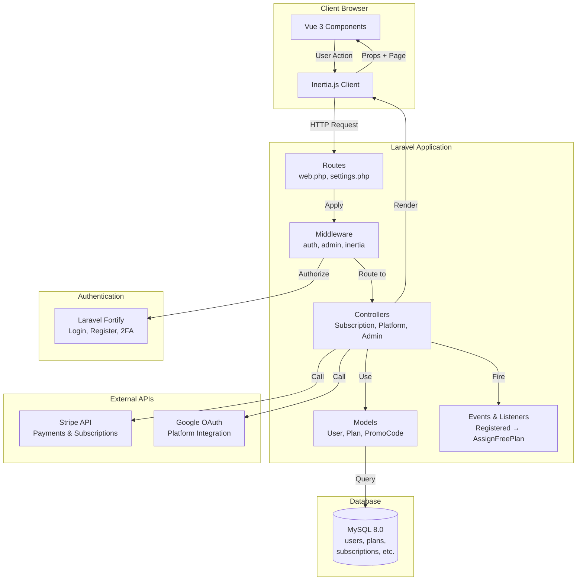
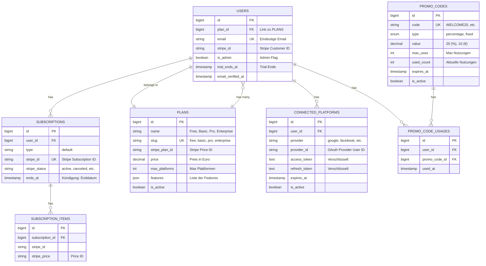
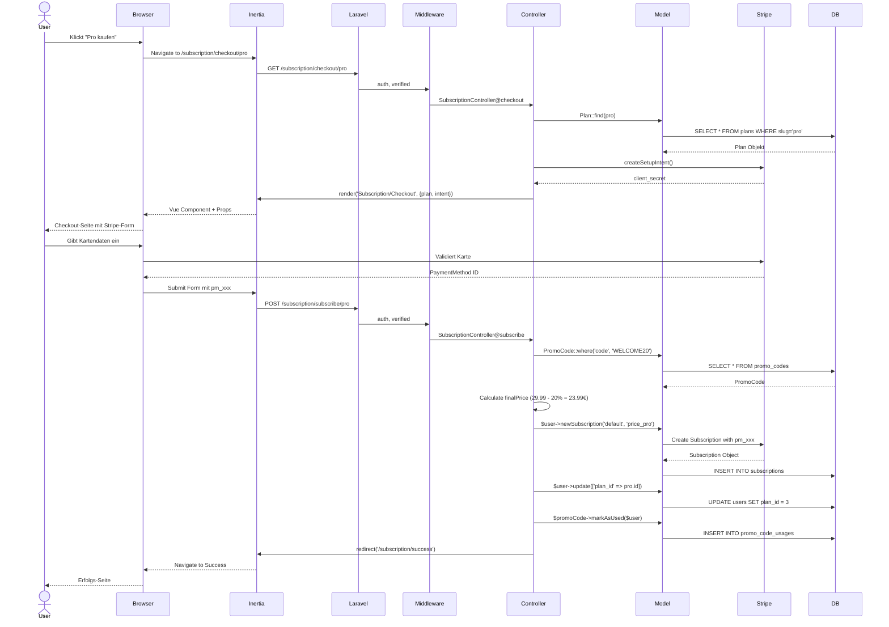
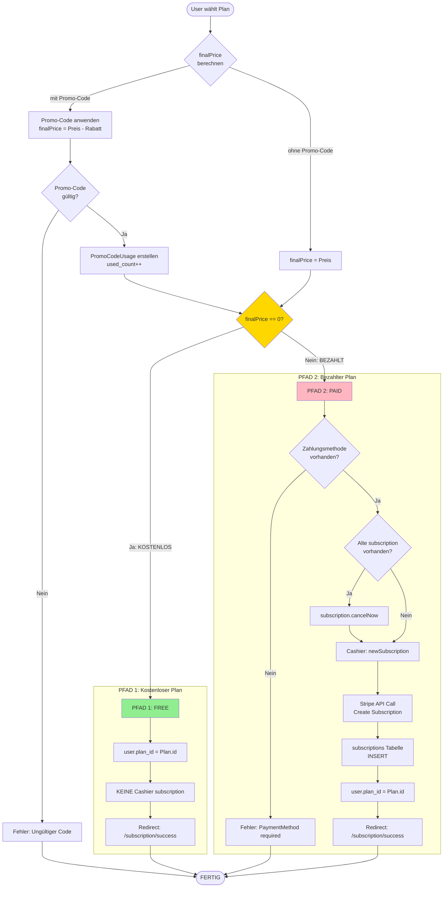
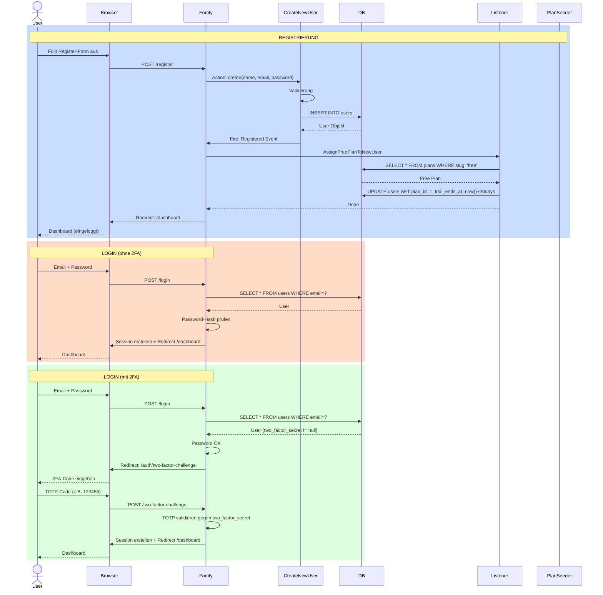
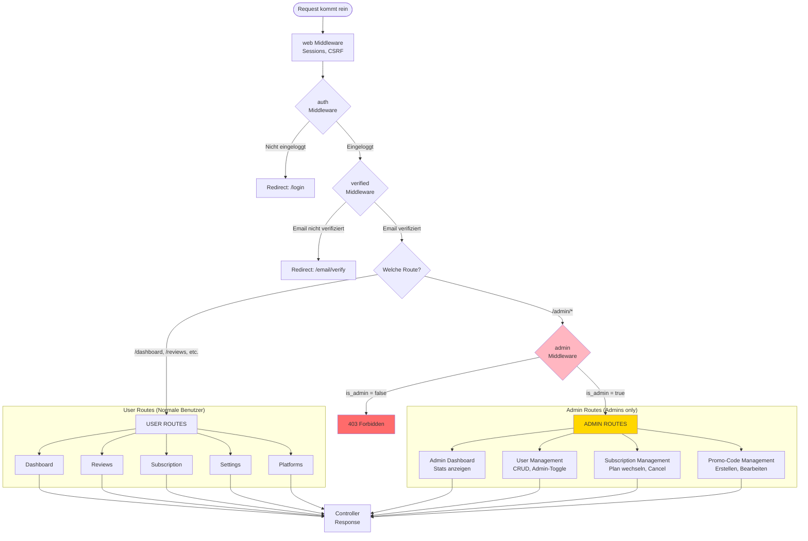
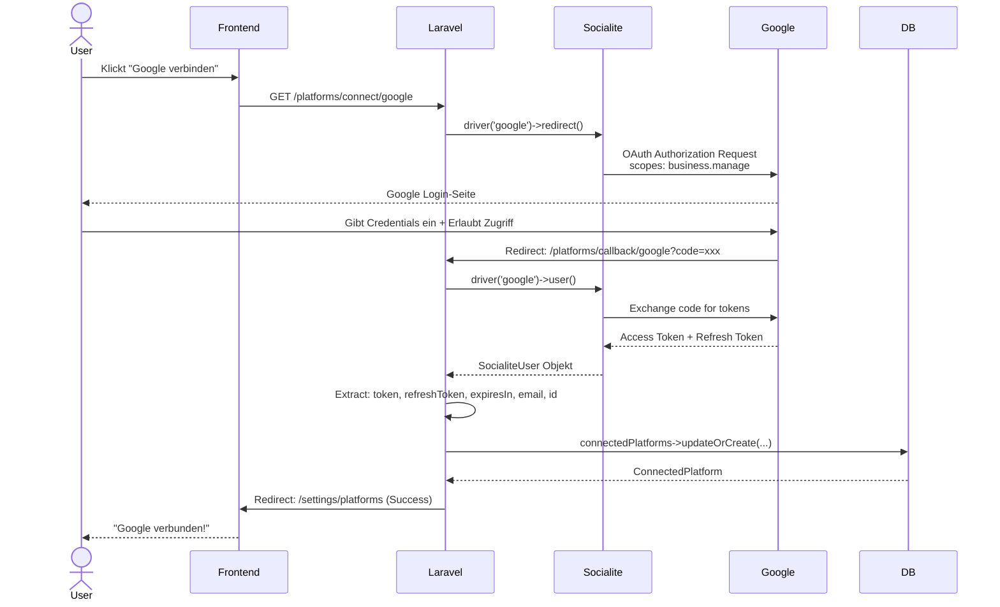

# RatingsHub - Architektur & Interaktions-Dokumentation

> Vollständige Erklärung der Systemarchitektur mit visuellen Diagrammen
>
> **Erstellt:** 2025-11-06
> **Projekt:** RatingsHub SaaS Platform

---

## Inhaltsverzeichnis

1. [System-Übersicht](#system-übersicht)
2. [Gesamtarchitektur](#gesamtarchitektur)
3. [Datenbank-Schema & Beziehungen](#datenbank-schema--beziehungen)
4. [Request-Lifecycle](#request-lifecycle)
5. [Subscription-System Flow](#subscription-system-flow)
6. [Authentifizierung Flow](#authentifizierung-flow)
7. [Admin vs. User Flow](#admin-vs-user-flow)
8. [Platform OAuth Integration](#platform-oauth-integration)
9. [Warum diese Architektur?](#warum-diese-architektur)

---

## System-Übersicht

### Was ist RatingsHub?

RatingsHub ist eine **SaaS-Plattform für Review-Management**, die es Unternehmen ermöglicht:
- Bewertungen von mehreren Plattformen (Google, Trustpilot, etc.) zu sammeln
- Bewertungen zentral zu verwalten
- Auf Bewertungen zu antworten
- Analytics über Bewertungen zu erhalten

### Tech Stack im Überblick

```
┌─────────────────────────────────────────────────────────┐
│                    FRONTEND LAYER                        │
│  Vue 3 + Inertia.js + TailwindCSS + Reka UI             │
│  (Single Page App Experience ohne API)                  │
└───────────────────────┬─────────────────────────────────┘
                        │
                        │ HTTP Requests (Inertia)
                        │
┌───────────────────────▼─────────────────────────────────┐
│                   BACKEND LAYER                          │
│  Laravel 11 + Fortify + Cashier + Socialite            │
│  (Business Logic, Auth, Payments, OAuth)                │
└───────────────────────┬─────────────────────────────────┘
                        │
                        │ Eloquent ORM
                        │
┌───────────────────────▼─────────────────────────────────┐
│                   DATABASE LAYER                         │
│  MySQL 8.0                                              │
│  (Users, Plans, Subscriptions, Platforms, etc.)        │
└───────────────────────┬─────────────────────────────────┘
                        │
┌───────────────────────▼─────────────────────────────────┐
│                  EXTERNAL SERVICES                       │
│  Stripe (Payments) + Google OAuth (Platforms)           │
└─────────────────────────────────────────────────────────┘
```

---

## Gesamtarchitektur

### High-Level Systemarchitektur



### **Erklärung der Komponenten:**

#### **1. Frontend (Vue 3 + Inertia.js)**

**Warum Vue 3?**
- Modern, reaktiv, leicht zu lernen
- Composition API: Bessere Code-Organisation
- Große Community, viele Komponenten

**Warum Inertia.js?**
- **Kein API-Layer nötig**: Laravel-Props direkt in Vue
- SSR-fähig (Server-Side Rendering möglich)
- Bessere UX als traditionelle Blade-Templates
- Weniger Code als separate REST/GraphQL API

**Wie funktioniert Inertia?**
```
User klickt Button → Inertia sendet HTTP-Request → Laravel Controller
→ Controller gibt Props + Page-Name zurück → Inertia rendert Vue-Component
→ Kein Full-Page-Reload! (SPA-Experience)
```

#### **2. Backend (Laravel 11)**

**Warum Laravel?**
- **Fortify**: Auth out-of-the-box (Login, Register, 2FA)
- **Cashier**: Stripe-Integration vereinfacht
- **Socialite**: OAuth einfach gemacht
- Eloquent ORM: Einfache Datenbank-Queries
- Migrations: Versionskontrolle für Datenbank

**Middleware-Stack:**
```
Request → web (sessions, csrf)
        → auth (ist User eingeloggt?)
        → verified (ist Email verifiziert?)
        → admin (ist User Admin?)
        → Controller
```

#### **3. Database (MySQL 8.0)**

**Warum MySQL?**
- Weit verbreitet, stabil
- Gute Performance für SaaS
- JSON-Spalten für flexible Features

---

## Datenbank-Schema & Beziehungen

### Entity-Relationship Diagram



### **Warum diese Beziehungen?**

#### **1. User → Plan (belongsTo)**

```php
// User.php
public function plan(): BelongsTo
{
    return $this->belongsTo(Plan::class);
}
```

**Warum plan_id auf User?**
- ✅ Schneller Zugriff: `$user->plan->name` (1 Query)
- ✅ Funktioniert auch ohne Cashier subscription
- ✅ Einfach: Kein Join nötig

**Alternative (schlecht):**
```php
// Plan über Subscription ermitteln
$plan = $user->subscription('default')->items->first()->price->plan;
// ❌ Kompliziert, viele Queries
// ❌ Funktioniert nicht ohne active subscription
```

#### **2. User → Subscriptions (hasMany via Cashier)**

```php
// User.php (via Billable Trait)
$user->subscriptions()  // Alle Subscriptions
$user->subscription('default')  // Aktuelle "default" subscription
```

**Warum kann User mehrere Subscriptions haben?**
- Historische Subscriptions (canceled)
- Verschiedene Typen ('default', 'addon', etc.)

**Warum type = "default"?**
- Laravel Cashier Convention
- Ermöglicht später: Addons als separate subscriptions

#### **3. PromoCode → PromoCodeUsages (hasMany)**

```php
// PromoCode.php
public function usages(): HasMany
{
    return $this->hasMany(PromoCodeUsage::class);
}
```

**Warum separate Tabelle?**
- ✅ Track: Wer hat wann Code genutzt?
- ✅ Unique Constraint: User kann Code nur 1x nutzen
- ✅ Admin-Nutzungen zählen nicht zu max_uses

**Alternative (schlecht):**
```php
// JSON-Spalte in promo_codes
'used_by' => [1, 5, 12, 42]
// ❌ Schwer zu querien
// ❌ Keine Timestamps
// ❌ Keine Beziehungen
```

#### **4. User → ConnectedPlatforms (hasMany)**

```php
// User.php
public function connectedPlatforms(): HasMany
{
    return $this->hasMany(ConnectedPlatform::class);
}
```

**Warum Unique Constraint (user_id, provider)?**
```sql
UNIQUE KEY (user_id, provider)
```
- User kann Google nur 1x verbinden
- ABER: Kann Google UND Facebook verbinden

---

## Request-Lifecycle

### Typischer Request-Flow (User kauft Subscription)



### **Erklärung der Schritte:**

#### **1. GET Request (Checkout-Seite laden)**

```php
// SubscriptionController@checkout
public function checkout(Plan $plan)
{
    // Laravel Route Model Binding:
    // /checkout/pro → automatisch Plan mit slug='pro' geladen

    $user = auth()->user();

    // Stripe Setup Intent erstellen
    $intent = $user->createSetupIntent();

    // Inertia rendert Vue-Component mit Props
    return Inertia::render('Subscription/Checkout', [
        'plan' => $plan,
        'intent' => $intent,  // client_secret für Stripe
    ]);
}
```

**Warum Setup Intent?**
- Stripe benötigt `client_secret` für Card-Element
- Setup Intent = "Zahlungsmethode speichern ohne sofort zu laden"
- Bei Submit wird PaymentMethod ID generiert

#### **2. POST Request (Subscription erstellen)**

```php
// SubscriptionController@subscribe
public function subscribe(Request $request, Plan $plan)
{
    $user = auth()->user();

    // Promo-Code anwenden
    $finalPrice = $plan->price;
    if ($request->promo_code) {
        $promoCode = PromoCode::where('code', $request->promo_code)->first();
        $finalPrice = $promoCode->applyDiscount($plan->price);
    }

    // HYBRID-LOGIK
    if ($finalPrice == 0) {
        // Kostenlos: Nur plan_id setzen
        $user->update(['plan_id' => $plan->id]);
    } else {
        // Bezahlt: Cashier subscription
        $user->newSubscription('default', $plan->stripe_plan_id)
             ->create($request->payment_method);
        $user->update(['plan_id' => $plan->id]);
    }

    return redirect()->route('subscription.success');
}
```

---

## Subscription-System Flow

### Hybrid-System: Zwei Pfade



### **Warum Hybrid-System?**

#### **Vorteil 1: Kostenlose Nutzung ohne Stripe-Overhead**

```
Free-Plan User:
  ✅ Kein Stripe Account nötig
  ✅ Keine Zahlungsmethode erforderlich
  ✅ Einfache Registrierung
  ✅ Schnellerer Onboarding
```

#### **Vorteil 2: Flexibilität für Promo-Codes**

```
Promo-Code "FREE100" (100% Rabatt):
  Original: Pro-Plan (29.99€)
  Rabatt: -100%
  finalPrice: 0€

  → Nutzt PFAD 1 (Free)
  → User bekommt Pro-Features OHNE Stripe subscription
  → Kein automatisches Billing nach Trial
```

#### **Vorteil 3: Saubere Trennung**

```
Kostenlos:                    Bezahlt:
- plan_id ✓                   - plan_id ✓
- subscription ✗              - subscription ✓
- Rechnungen ✗                - Rechnungen ✓
- Cancel/Resume ✗             - Cancel/Resume ✓
```

### **Nachteil & Komplexität:**

```
Problem: Zwei Datenquellen für "Welchen Plan hat der User?"

Lösung 1: Immer plan_id prüfen (aktueller Stand)
  → Schnell, einfach
  → ABER: Subscription-Status nicht berücksichtigt

Lösung 2: plan_id + subscription.stripe_status kombinieren
  → Genauer
  → ABER: Komplexer

Aktuell: Lösung 1
  → plan_id ist "Source of Truth"
  → subscription nur für Billing/Cancel/Resume
```

---

## Authentifizierung Flow

### Registrierung & Login mit Fortify



### **Warum Laravel Fortify?**

#### **Vorteil 1: Out-of-the-Box Features**

```php
// Ohne Fortify (manuell):
- Login-Logic: 50+ Zeilen
- Register-Logic: 60+ Zeilen
- Password-Reset: 100+ Zeilen
- 2FA: 200+ Zeilen
- Email-Verification: 80+ Zeilen

// Mit Fortify:
- Installation: composer require laravel/fortify
- Konfiguration: 10 Zeilen in FortifyServiceProvider
- Fertig! ✅
```

#### **Vorteil 2: Sicherheit**

- Password-Hashing: bcrypt automatisch
- Rate-Limiting: Built-in
- CSRF-Protection: Automatisch
- 2FA: TOTP standard-konform

#### **Vorteil 3: Inertia-kompatibel**

```php
// FortifyServiceProvider
Fortify::loginView(function () {
    return Inertia::render('auth/Login');
});

Fortify::registerView(function () {
    return Inertia::render('auth/Register');
});
```

---

## Admin vs. User Flow

### Unterschiedliche Zugriffsebenen



### **Middleware-Stack Beispiel**

#### **User-Route:**

```php
// routes/web.php
Route::middleware(['auth', 'verified'])
    ->get('/dashboard', function () {
        return Inertia::render('Dashboard');
    });
```

**Middleware-Reihenfolge:**
```
1. web (sessions, csrf) → IMMER
2. auth → Prüft: User eingeloggt?
3. verified → Prüft: Email verifiziert?
4. Controller
```

#### **Admin-Route:**

```php
// routes/web.php
Route::middleware(['auth', 'verified', 'admin'])
    ->prefix('admin')
    ->group(function () {
        Route::get('/users', [UserController::class, 'index']);
    });
```

**Middleware-Reihenfolge:**
```
1. web → IMMER
2. auth → User eingeloggt?
3. verified → Email verifiziert?
4. admin → is_admin = true?
5. Controller
```

**Admin-Middleware Code:**

```php
// app/Http/Middleware/EnsureUserIsAdmin.php
public function handle(Request $request, Closure $next)
{
    if (!$request->user() || !$request->user()->is_admin) {
        abort(403, 'Unauthorized action.');
    }

    return $next($request);
}
```

### **Warum is_admin Boolean statt Roles?**

#### **Aktuell (einfach):**

```php
// User.php
$user->is_admin  // true/false

// Check in Middleware
if ($user->is_admin) { ... }
```

**Vorteile:**
- ✅ Einfach
- ✅ Schnell
- ✅ Kein Extra-Package
- ✅ Für kleine Apps ausreichend

#### **Alternative (komplex):**

```php
// Mit Spatie Permission Package
$user->hasRole('admin')
$user->can('edit-users')
$user->assignRole('super-admin')
```

**Wann nötig?**
- ❓ Mehrere Rollen (Admin, Moderator, Manager, etc.)
- ❓ Granulare Permissions (edit-posts, delete-users, etc.)
- ❓ Role-Hierarchien

**Aktuell: NICHT nötig**
- Nur 2 Ebenen: Admin vs. User
- Boolean reicht aus

---

## Platform OAuth Integration

### Google My Business OAuth Flow



### **Warum OAuth statt API-Keys?**

#### **OAuth (aktuell):**

```
Vorteile:
  ✅ Sicherer: User gibt RatingsHub nie sein Google-Passwort
  ✅ Granular: User kann Zugriff jederzeit widerrufen
  ✅ Standard: Google, Facebook, etc. nutzen OAuth
  ✅ Scoped: Nur Zugriff auf business.manage, nicht alles

Nachteile:
  ❌ Komplexer: Token-Refresh nötig
  ❌ Token expiren: Access Token nach 1h ungültig
```

#### **API-Keys (Alternative):**

```
Vorteile:
  ✅ Einfacher: Key generieren, fertig
  ✅ Kein Expiry: Key läuft nicht ab

Nachteile:
  ❌ Unsicherer: Key kann leaked werden
  ❌ Keine Granularität: Oft "voller Zugriff"
  ❌ Nicht Standard: Jede Platform anders
```

### **Token-Speicherung in DB**

```php
// ConnectedPlatform Model
protected $hidden = [
    'access_token',
    'refresh_token',
];

// Warum hidden?
// → Bei API-Responses (JSON) werden Tokens NICHT mitgeschickt
// → Sicherheit: Verhindert versehentliches Leaken
```

**Verschlüsselung:**

```php
// OPTIONAL: Tokens verschlüsseln
protected $casts = [
    'access_token' => 'encrypted',
    'refresh_token' => 'encrypted',
];

// Laravel verschlüsselt automatisch mit APP_KEY
```

---

## Warum diese Architektur?

### Design-Entscheidungen & Begründungen

#### **1. Warum Inertia.js statt REST API?**

**REST API (Alternative):**
```
Frontend (Vue SPA)
    ↓ Axios
Backend (Laravel API)
    ↓ JSON Responses

Vorteile:
  - Frontend komplett getrennt
  - Kann mobile App nutzen

Nachteile:
  - Doppelter Code (API Resources + Vue Models)
  - CORS-Probleme
  - Mehr Boilerplate
  - Token-Verwaltung (JWT, Sanctum)
```

**Inertia.js (aktuell):**
```
Frontend (Vue)
    ↓ Inertia Request
Backend (Laravel)
    ↓ Props direkt

Vorteile:
  ✅ Weniger Code
  ✅ Laravel-Props direkt in Vue
  ✅ Kein CORS
  ✅ Sessions statt Tokens
  ✅ SSR möglich

Nachteile:
  - Kein mobiles App (noch)
  - Frontend + Backend gekoppelt
```

**Wann REST API sinnvoll?**
- Mobile App geplant
- Frontend komplett getrennt deployen
- Mehrere Clients (Web, iOS, Android)

**Wann Inertia sinnvoll?**
- Nur Web-App
- Schnelle Entwicklung
- SSR gewünscht

---

#### **2. Warum plan_id auf User statt nur Subscription?**

**Nur Subscription (Alternative):**
```php
// Plan ermitteln
$plan = $user->subscription('default')
             ->items->first()
             ->price
             ->product
             ->plan;

// Probleme:
❌ 4+ DB-Queries
❌ Funktioniert nicht ohne active subscription
❌ Kompliziert
```

**plan_id auf User (aktuell):**
```php
// Plan ermitteln
$plan = $user->plan;

// Vorteile:
✅ 1 Query (mit Eager Loading: 0 extra Queries)
✅ Funktioniert auch für Free-Plan
✅ Einfach
```

**Warum BEIDE (plan_id + subscription)?**
```
plan_id:
  → "Source of Truth" für Features
  → Schneller Zugriff

subscription:
  → Billing-Informationen
  → Cancel/Resume
  → Rechnungen
```

---

#### **3. Warum PromoCodeUsages separate Tabelle?**

**JSON-Spalte (Alternative):**
```php
// promo_codes Tabelle
'used_by' => [1, 5, 12, 42]  // User-IDs

// Check
$usedBy = json_decode($promoCode->used_by);
if (in_array($user->id, $usedBy)) { ... }

// Probleme:
❌ Kann nicht querien: "Welche Codes hat User X genutzt?"
❌ Keine Timestamps (Wann genutzt?)
❌ Schwer zu analysieren
```

**Separate Tabelle (aktuell):**
```php
// promo_code_usages Tabelle
id | user_id | promo_code_id | used_at

// Vorteile:
✅ Query: PromoCodeUsage::where('user_id', 1)->get()
✅ Timestamps
✅ Beziehungen (User, PromoCode)
✅ Analytics möglich
```

---

#### **4. Warum Middleware-Stack (auth → verified → admin)?**

**Reihenfolge wichtig:**

```php
// Richtig (aktuell):
Route::middleware(['auth', 'verified', 'admin'])

// Falsch:
Route::middleware(['admin', 'auth', 'verified'])
// → admin prüft zuerst, aber $request->user() ist noch null!
// → Fehler!
```

**Warum verified vor admin?**
```
1. auth: User eingeloggt?
2. verified: Email verifiziert?
   → Sicherheit: Nur verifizierte User
3. admin: is_admin true?
   → Nur Admins mit verifizierten Emails
```

---

#### **5. Warum Events (Registered → AssignFreePlan)?**

**Direkt in Controller (Alternative):**
```php
// RegisterController
public function register(Request $request)
{
    $user = User::create(...);

    // Free Plan zuweisen
    $freePlan = Plan::where('slug', 'free')->first();
    $user->update(['plan_id' => $freePlan->id]);

    // Email senden
    Mail::to($user)->send(new WelcomeEmail());

    // Analytics
    Analytics::track('user_registered', $user);

    return redirect('/dashboard');
}

// Problem:
❌ Controller wird fett
❌ Nicht testbar (einzeln)
❌ Nicht wiederverwendbar
```

**Events (aktuell):**
```php
// Fortify CreateNewUser Action
public function create(array $input): User
{
    return User::create([...]);

    // → Fired automatisch: Registered Event
}

// Listener: AssignFreePlanToNewUser
public function handle(Registered $event)
{
    $freePlan = Plan::where('slug', 'free')->first();
    $event->user->update(['plan_id' => $freePlan->id]);
    $event->user->startTrial(30);
}

// Weitere Listener möglich:
// - SendWelcomeEmail
// - TrackRegistrationAnalytics
// - NotifyAdmins

// Vorteile:
✅ Separation of Concerns
✅ Testbar
✅ Wiederverwendbar
✅ Leicht zu erweitern
```

---

## Zusammenfassung: Warum diese Architektur?

### Hauptziele

1. **Schnelle Entwicklung**
   - Inertia: Kein API-Layer
   - Fortify: Auth out-of-the-box
   - Cashier: Stripe vereinfacht

2. **Flexibilität**
   - Hybrid Subscriptions: Free + Paid
   - Promo-Codes: Prozentual + Fest
   - OAuth: Mehrere Provider

3. **Skalierbar**
   - Events: Leicht erweiterbar
   - Middleware: Modulares System
   - DB-Struktur: Normalisiert

4. **Wartbar**
   - MVC-Pattern: Klare Struktur
   - Eloquent: Lesbare Queries
   - Vue Components: Wiederverwendbar

### Trade-offs

**Was gut funktioniert:**
- ✅ Subscription-System (Hybrid clever)
- ✅ Auth (Fortify robust)
- ✅ Admin-Panel (Übersichtlich)

**Was komplexer ist:**
- ⚠️ Hybrid-System: Zwei Datenquellen für Plan
- ⚠️ Token-Refresh: OAuth-Tokens expiren
- ⚠️ plan_id Sync: Manuell bei Downgrades

**Was fehlt noch:**
- ❌ Webhooks: Stripe-Events nicht verarbeitet
- ❌ Tests: Keine automatisierten Tests
- ❌ Logging: Wenig Audit-Logs

---

**Ende der Architektur-Dokumentation**

Für konkrete Probleme siehe: [SYSTEM_ANALYSIS.md](./SYSTEM_ANALYSIS.md)
